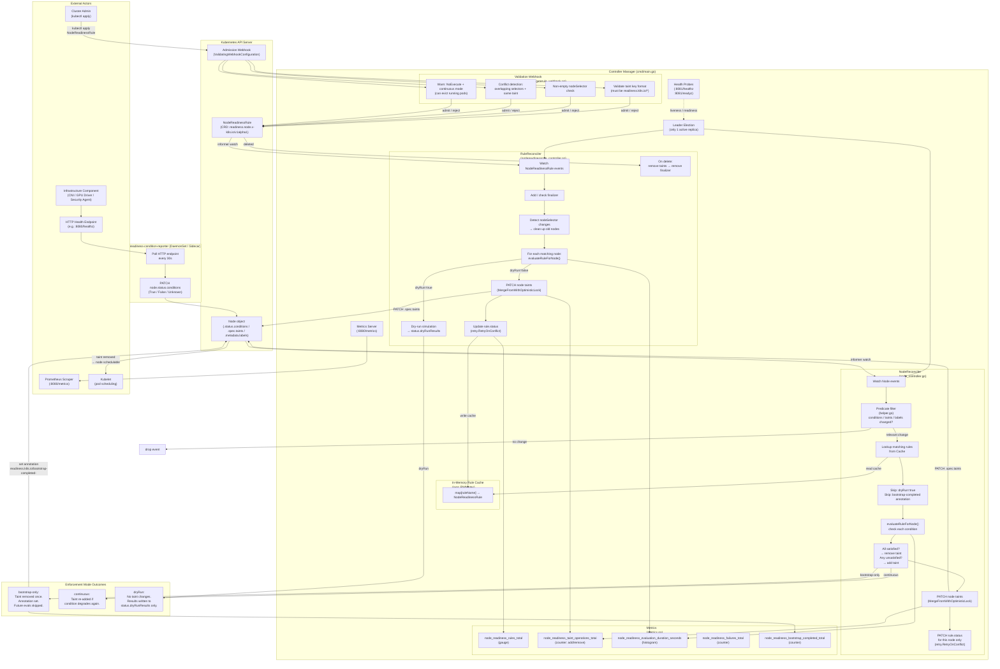
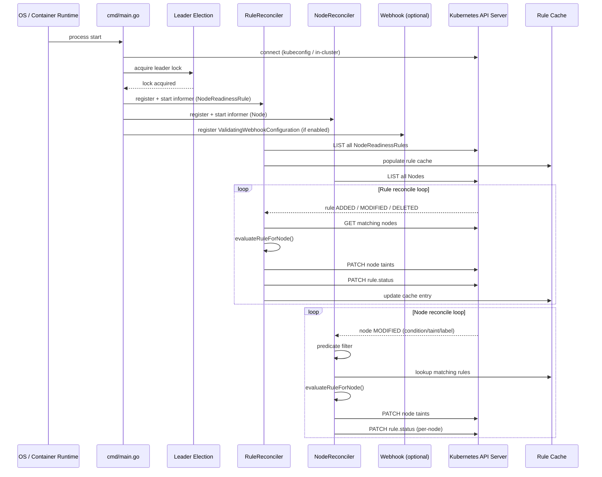
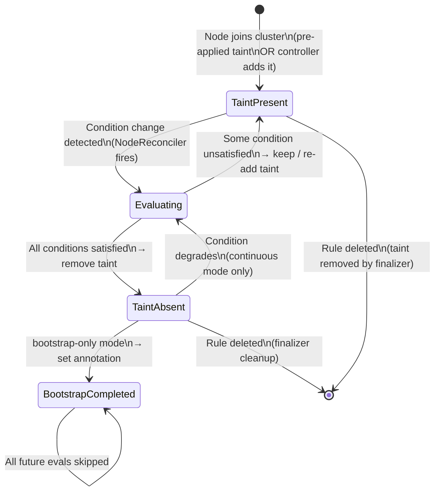

# Node Readiness Controller — Full Architecture Diagram

## Component Wiring & Data Flow

```mermaid
flowchart TD
    %% ─── External Actors ───────────────────────────────────────────
    subgraph EXTERNAL["External Actors"]
        INFRA["Infrastructure Component\n(CNI / GPU Driver / Security Agent)"]
        HTTP["HTTP Health Endpoint\n(e.g. :8080/healthz)"]
        ADMIN["Cluster Admin\n(kubectl apply)"]
        PROM["Prometheus Scraper\n(:8080/metrics)"]
        KUBELET["Kubelet\n(pod scheduling)"]
    end

    %% ─── readiness-condition-reporter ──────────────────────────────
    subgraph REPORTER["readiness-condition-reporter (DaemonSet / Sidecar)"]
        POLL["Poll HTTP endpoint\nevery 30s"]
        CONDWRITE["PATCH node.status.conditions\n(True / False / Unknown)"]
    end

    %% ─── Kubernetes API Server ──────────────────────────────────────
    subgraph APISERVER["Kubernetes API Server"]
        CRD["NodeReadinessRule\n(CRD: readiness.node.x-k8s.io/v1alpha1)"]
        NODE_OBJ["Node object\n(.status.conditions / .spec.taints / .metadata.labels)"]
        WEBHOOK_INTERCEPT["Admission Webhook\n(ValidatingWebhookConfiguration)"]
    end

    %% ─── Controller Manager ─────────────────────────────────────────
    subgraph MANAGER["Controller Manager (cmd/main.go)"]
        LEADER["Leader Election\n(only 1 active replica)"]
        HEALTH["Health Probes\n(:8081/healthz\n:8081/readyz)"]
        METRICS_SRV["Metrics Server\n(:8080/metrics)"]

        subgraph CACHE["In-Memory Rule Cache\n(sync.RWMutex)"]
            CACHE_MAP["map[ruleName] → NodeReadinessRule"]
        end

        subgraph RULE_REC["RuleReconciler\n(nodereadinessrule_controller.go)"]
            RR1["Watch NodeReadinessRule events"]
            RR2["Add / check finalizer"]
            RR3["Detect nodeSelector changes\n→ clean up old nodes"]
            RR4["For each matching node:\nevaluateRuleForNode()"]
            RR5["Dry-run simulation\n→ status.dryRunResults"]
            RR6["PATCH node taints\n(MergeFromWithOptimisticLock)"]
            RR7["Update rule.status\n(retry.RetryOnConflict)"]
            RR8["On delete:\nremove taints → remove finalizer"]
        end

        subgraph NODE_REC["NodeReconciler\n(node_controller.go)"]
            NR1["Watch Node events"]
            NR2["Predicate filter\n(helper.go)\nconditions / taints / labels changed?"]
            NR3["Lookup matching rules\nfrom Cache"]
            NR4["Skip: dryRun=true\nSkip: bootstrap-completed annotation"]
            NR5["evaluateRuleForNode()\ncheck each condition"]
            NR6["All satisfied?\n→ remove taint\nAny unsatisfied?\n→ add taint"]
            NR7["PATCH node taints\n(MergeFromWithOptimisticLock)"]
            NR8["PATCH rule.status\nfor this node only\n(retry.RetryOnConflict)"]
        end

        subgraph WEBHOOK["Validation Webhook\n(nodereadinessgaterule_webhook.go)"]
            WH1["Validate taint key format\n(must be readiness.k8s.io/*)"]
            WH2["Non-empty nodeSelector check"]
            WH3["Conflict detection:\noverlapping selectors + same taint"]
            WH4["Warn: NoExecute + continuous mode\n(can evict running pods)"]
        end

        subgraph METRICS["Metrics\n(metrics.go)"]
            M1["node_readiness_rules_total\n(gauge)"]
            M2["node_readiness_taint_operations_total\n(counter: add/remove)"]
            M3["node_readiness_evaluation_duration_seconds\n(histogram)"]
            M4["node_readiness_failures_total\n(counter)"]
            M5["node_readiness_bootstrap_completed_total\n(counter)"]
        end
    end

    %% ─── Enforcement Modes ──────────────────────────────────────────
    subgraph MODES["Enforcement Mode Outcomes"]
        BOOT["bootstrap-only:\nTaint removed once.\nAnnotation set.\nFuture evals skipped."]
        CONT["continuous:\nTaint re-added if\ncondition degrades again."]
        DRY["dryRun:\nNo taint changes.\nResults written to\nstatus.dryRunResults only."]
    end

    %% ─── Flows ──────────────────────────────────────────────────────

    %% Infra → Reporter → Node
    INFRA --> HTTP
    HTTP --> POLL
    POLL --> CONDWRITE
    CONDWRITE --> NODE_OBJ

    %% Admin creates rule
    ADMIN -->|"kubectl apply\nNodeReadinessRule"| WEBHOOK_INTERCEPT
    WEBHOOK_INTERCEPT --> WH1 & WH2 & WH3 & WH4
    WH1 & WH2 & WH3 & WH4 -->|"admit / reject"| CRD

    %% Controller Manager startup
    LEADER --> RR1 & NR1
    CRD -->|"informer watch"| RR1
    NODE_OBJ -->|"informer watch"| NR1

    %% RuleReconciler flow
    RR1 --> RR2 --> RR3 --> RR4
    RR4 -->|"dryRun=true"| RR5
    RR4 -->|"dryRun=false"| RR6
    RR6 --> RR7
    RR7 -->|"write cache"| CACHE_MAP
    CRD -->|"deleted"| RR8

    %% NodeReconciler flow
    NR1 --> NR2
    NR2 -->|"no change"| DISCARD["drop event"]
    NR2 -->|"relevant change"| NR3
    NR3 -->|"read cache"| CACHE_MAP
    NR3 --> NR4 --> NR5 --> NR6 --> NR7 --> NR8

    %% Enforcement modes branching
    NR6 -->|"bootstrap-only"| BOOT
    NR6 -->|"continuous"| CONT
    RR5 -->|"dryRun"| DRY

    %% Taint changes back to API server
    RR6 -->|"PATCH .spec.taints"| NODE_OBJ
    NR7 -->|"PATCH .spec.taints"| NODE_OBJ

    %% Bootstrap annotation
    BOOT -->|"set annotation\nreadiness.k8s.io/bootstrap-completed-<rule>"| NODE_OBJ

    %% Kubelet reacts to taint removal
    NODE_OBJ -->|"taint removed\n→ node schedulable"| KUBELET

    %% Metrics
    RR6 --> M2
    NR7 --> M2
    RR4 --> M3
    NR5 --> M3
    RR7 --> M1
    BOOT --> M5
    METRICS_SRV --> PROM

    %% Health
    HEALTH -.->|"liveness / readiness"| LEADER
```

---

## Startup Sequence

```mermaid
sequenceDiagram
    participant OS as OS / Container Runtime
    participant MAIN as cmd/main.go
    participant LE as Leader Election
    participant RR as RuleReconciler
    participant NR as NodeReconciler
    participant WH as Webhook (optional)
    participant API as Kubernetes API Server
    participant CACHE as Rule Cache

    OS->>MAIN: process start
    MAIN->>API: connect (kubeconfig / in-cluster)
    MAIN->>LE: acquire leader lock
    LE-->>MAIN: lock acquired

    MAIN->>RR: register + start informer (NodeReadinessRule)
    MAIN->>NR: register + start informer (Node)
    MAIN->>WH: register ValidatingWebhookConfiguration (if enabled)

    RR->>API: LIST all NodeReadinessRules
    RR->>CACHE: populate rule cache
    NR->>API: LIST all Nodes

    loop Rule reconcile loop
        API-->>RR: rule ADDED / MODIFIED / DELETED
        RR->>API: GET matching nodes
        RR->>RR: evaluateRuleForNode()
        RR->>API: PATCH node taints
        RR->>API: PATCH rule.status
        RR->>CACHE: update cache entry
    end

    loop Node reconcile loop
        API-->>NR: node MODIFIED (condition/taint/label)
        NR->>NR: predicate filter
        NR->>CACHE: lookup matching rules
        NR->>NR: evaluateRuleForNode()
        NR->>API: PATCH node taints
        NR->>API: PATCH rule.status (per-node)
    end
```

---

## Taint Lifecycle State Machine

```mermaid
stateDiagram-v2
    [*] --> TaintPresent : Node joins cluster\n(pre-applied taint\nOR controller adds it)

    TaintPresent --> Evaluating : Condition change detected\n(NodeReconciler fires)
    Evaluating --> TaintPresent : Some condition unsatisfied\n→ keep / re-add taint
    Evaluating --> TaintAbsent : All conditions satisfied\n→ remove taint

    TaintAbsent --> Evaluating : Condition degrades\n(continuous mode only)
    TaintAbsent --> BootstrapCompleted : bootstrap-only mode\n→ set annotation

    BootstrapCompleted --> BootstrapCompleted : All future evals skipped
    TaintAbsent --> [*] : Rule deleted\n(finalizer cleanup)
    TaintPresent --> [*] : Rule deleted\n(taint removed by finalizer)
```
